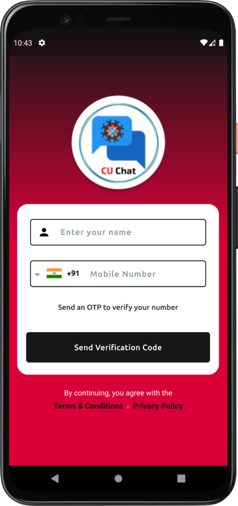
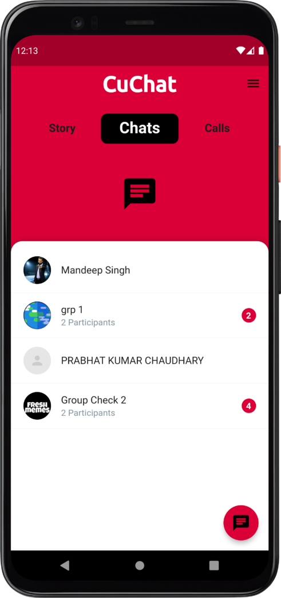
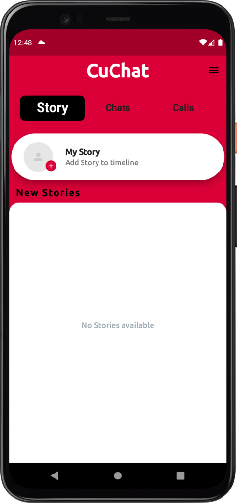
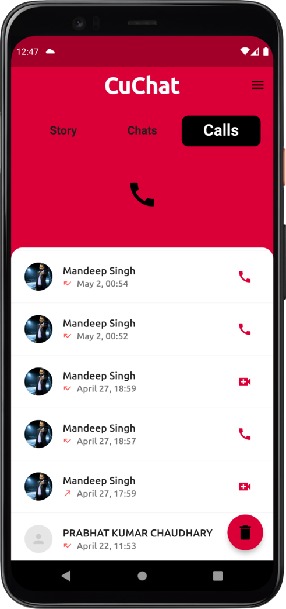
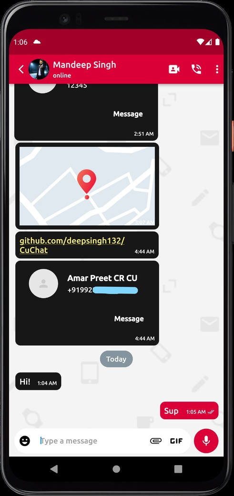
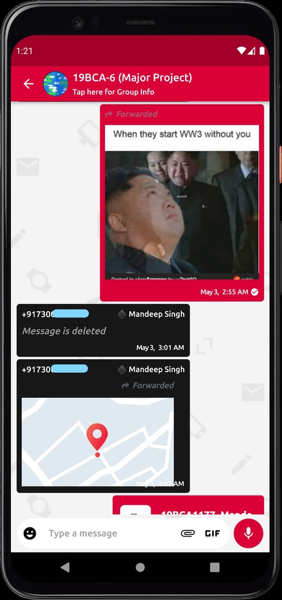
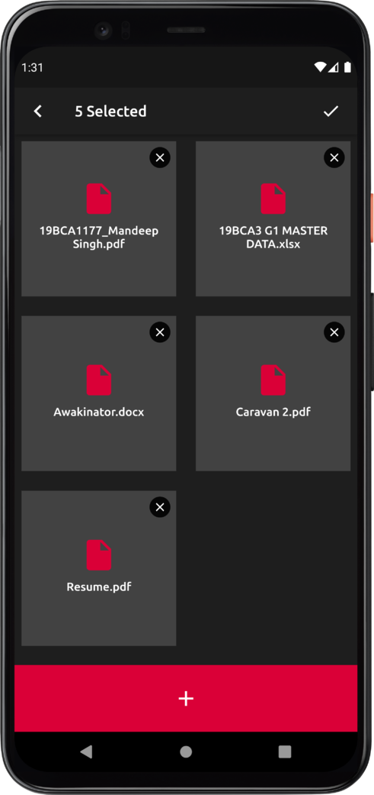
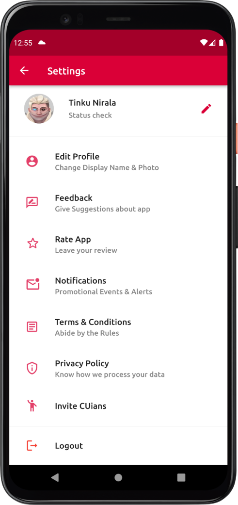

# CuChat 
---
## Major Project

<meta name="viewport" content="width=device-width, initial-scale=1.0, minimum-scale=1.0">

  
A software project created in flutter using Firebase-Firestore and Agora Video/Audio call API. The project supports both android and ios, clone the appropriate branches mentioned below:

* For Release build: https://github.com/deepsingh132/cuchat (stable channel)
* For Development: https://github.com/deepsingh132/cuchat/tree/beta (beta channel)

<div align="center"> 

  ## Screenshots 

</div>

<div align="center">
  
|   Registration/Login  | Homepage 
|:---------:|:------------:|
|  |   
| Story | Calls |  
|  |   
|   Chat  | Group Chat |                     
|   |   
|   Multi-Doc Picker  | Settings |                     
|  |   

</div>

## Getting Started

This repository contains the minimal implementation required to create and test the project. The repository code is preloaded with some basic components like basic app architecture, app theme, constants and required dependencies to create the project. This will also help in reducing setup & development time by allowing you to use the same code pattern and avoid re-writing from scratch.

App Link: https://github.com/deepsingh132/CuChat/releases/tag/v1.1-release0

## Setup Instructions 

**Step 1:**

Download or clone this repo by using the link below:

```
https://github.com/deepsingh132/cuchat.git
```

**Step 2:**

Go to the project root and execute the following command in the console to get the required dependencies: 

```
flutter pub get 
```

**Step 3:**

Make sure you have android SDK for android testing or mac os for ios, android/ios emulator, dart and flutter plugin installed for either vs code or android studio ide

```
cd 'project location'
flutter build apk --split-per-abi
flutter install
```

**Step 4:**

Go to the project root and execute the following command in the console to run the project: 

```
flutter run
```


## Project Features:

  ### Student/Faculty App
 
 * Support Android & iOS Devices
 * Intuitive UI/UX
 * OTP login
 * See Device Contacts
 * One-on-One Chat
 * Chat without Saving contact
 * Accept / Reject new user invitation to chat
 * User status (Online, Last seen, Typing)
 * Video Calling
 * Audio Calling
 * Call Logs (with Call duration)
 * Forward Messages
 * Share documents including video & images and zip files
 * Share Audio Recording
 * Share Contacts
 * Share Current Location
 * GIF Support (GIPHY api)
 * Download Media
 * Change chat background (Chat wallpaper)
 * Integrated video player
 * Block Chat
 * End-to-End Encryption (Only Sender and Recipient can read the messages Even Admin/Developer cannot read them [Based on SHA1 Encryption Algorithm])
 * Profile Page (Change Profile pic, Status, Display name)
 * Push Notifications (on new message, calls)
 * Post whats happening right now (12 hour stories)
 * Group Chat
 * User Profile View
 * Delete for Me/Everyone (Of course we added that)
 * Reply
 * Share Multi-Image & Multi-Documents
 * Send message to multiple people (Broadcast)

#### Up-Coming Features:

* Dark/Night Mode (Checkout Development branch for more updates)
* Theme Customization options for Students/Faculty app including buttons and main UI (Take this L Whatsapp lol)

### Admin/Source Control App

 * Advance Admin App Controls
 * Allow/block students and faculty from signing up
 * See All Joined Users
 * Check the total no of messages sent from a particular user (Not the message content only counts)
 * Temporarily disable the app for maintenance
 * Enable/disable any or all features for a specific user


### Libraries & Tools Used

* [Flutter](https://flutter.dev) (Framework)
* [Agora Video/Audio call api](https://github.com/AgoraIO)
* [Database](https://firebase.flutter.dev/docs/firestore/overview/)
* [Firebase Cloud Functions](https://firebase.google.com/docs/functions) (Auto trigger Push Notifications such as chat messages)
* [Cloud Storage](https://firebase.google.com/docs/storage) (Online Storage of Media)
* [Encryption](https://pub.dev/packages/crypto) (SHA1/MD5/HMAC)
* [Validation](https://pub.dev/packages/crclib) (Redundancy check on hashed functions)
* [Logging](https://firebase.google.com/docs/crashlytics)
* [Notifications](https://firebase.flutter.dev/docs/messaging/overview) (Manual notifications such as app updates and greetings)
* [GIF images library](https://pub.dev/packages/giphy_get) [Giphy Api](https://developers.giphy.com) (Api for searching and sending gifs)

### Folder Structure
Here is the core folder structure which flutter provides.

```
flutter-app/
  |- android
  |- build
  |- ios
  |- lib
  |- test
```

Here is the folder structure we used in this project

```
lib/
  |- Configs
  |- Models
  |- Screens
  |- Services
  |- Utils
  |- widgets
  |- test
  |- main.dart
```

### UI

This directory contains all the UI for the app. Each screen is located in a separate folder making it easy to combine a group of files related to that particular screen. All the screen-specific widgets will be placed in the `widgets` directory as shown in the example below:

```
Screens/
  |- auth_screens
  |- call_history
  |- calling_screen
  |- chat_screen
  |- contact_screens
  |- Groups
  |- homepage
  |- notifications
  |- privacypolicy&TnC
  |- profile_settings
  |- recent_chats
  |- search_chats
  |- security_screens
  |- SettingsOption
  |- sharing_intent
  |- splash_screen
  |- status
```

### Utils

Contains the common file(s) and utilities used in a project. The folder structure is as follows: 

```
Utils/
  |- alias.dart
  |- call_utilities.dart
  |- chat_controller.dart
  |- crc.dart
  |- open_settings.dart
  |- permissions.dart
  |- phonenumberVariantsGenerator.dart
  |- save.dart
  |- unawaited.dart
  |- utils.dart
```

### Widgets

Contains the common widgets that are shared across multiple screens. For example, Button, TextField etc.

```
widgets/
  |- Audioplayer
  |- AudioRecorder
  |- Common
  |- CountryPicker
  |- DocumentPicker
  |- ImagePicker
  |- InfiniteList
  |- MultiDocumentPicker
  |- MultiImagePicker
  |- MyElevatedButton
  |- Passcode
  |- PhoneField
  |- SoundPlayer
  |- VideoPicker
```


## Credits/Developers (Alphabetically)-

| Name                    | Uid       |
|-------------------------|-----------|
| Amar Preet Das          | 19BCA1129 |
| Atharv Singh            | 19BCA1132 |
| Mandeep Singh           | 19BCA1177 |
| Prabhat Kumar Chaudhary | 19BCA1172 |
| Vaibhav Arora           | 19BCA1131 |
